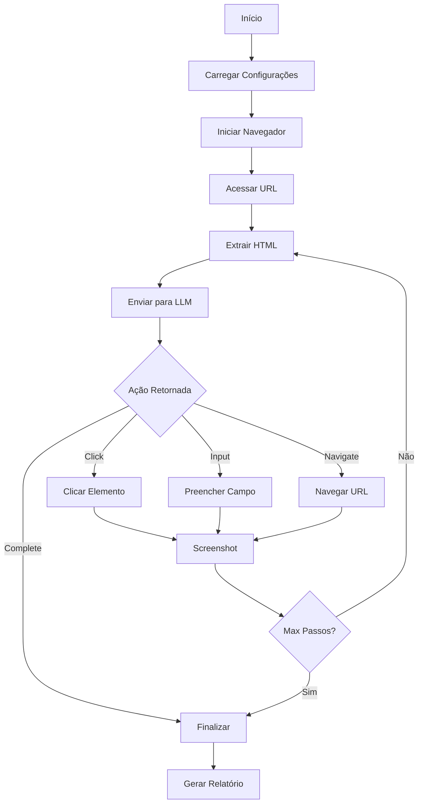

# 🤖 Agente de QA Automatizado

Sistema inteligente de automação de testes e navegação web utilizando Large Language Models (LLMs) para tomada de decisão contextual.

## 📋 Índice

- [Visão Geral](#visão-geral)
- [Arquitetura](#arquitetura)
- [Funcionalidades](#funcionalidades)
- [Instalação](#instalação)
- [Uso](#uso)
- [Configuração](#configuração)
- [Desenvolvimento](#desenvolvimento)
- [Testes](#testes)
- [Segurança](#segurança)
- [Contribuição](#contribuição)

## 🎯 Visão Geral

O Agente de QA Automatizado é uma solução completa para automação de testes web que utiliza inteligência artificial para:

- Navegar autonomamente em aplicações web
- Preencher formulários com dados contextuais
- Identificar e interagir com elementos da página
- Validar fluxos de navegação
- Gerar relatórios detalhados com screenshots

### Características Principais

- ✅ Navegação autônoma guiada por LLM
- ✅ Suporte a múltiplos provedores de LLM (LM Studio, Ollama, APIs externas)
- ✅ Interface web moderna (React + FastAPI)
- ✅ Interface desktop (Tkinter)
- ✅ Logs detalhados em tempo real
- ✅ Screenshots automáticos de cada etapa
- ✅ Arquitetura modular e extensível
- ✅ Validação de formulários
- ✅ Modo de teste automatizado

## 🏗️ Arquitetura

```
llm_agent_test/
├── agent/              # Módulos principais do agente
│   ├── browser.py      # Controle do navegador (Playwright)
│   ├── llm.py          # Interface com LLMs
│   ├── navigation_controller.py  # Controlador de navegação
│   ├── form_handler.py # Manipulação de formulários
│   ├── html_parser.py  # Parser de HTML
│   ├── io.py           # Operações de I/O
│   ├── config.py       # Configurações
│   ├── constants.py    # Constantes do sistema
│   ├── exceptions.py   # Exceções customizadas
│   └── llm_providers.py # Provedores de LLM
│
├── backend/            # API FastAPI
│   ├── api.py          # Endpoints REST + WebSocket
│   └── requirements.txt
│
├── frontend/           # Interface React
│   ├── src/
│   │   ├── App.jsx     # Componente principal
│   │   └── App.css     # Estilos
│   └── package.json
│
├── config/             # Arquivos de configuração
├── docs/               # Documentação
├── logs/               # Logs de execução (gitignored)
├── prints/             # Screenshots (gitignored)
├── scripts/            # Scripts utilitários
├── tests/              # Testes automatizados
│
├── main.py             # Script principal CLI
├── ui_agente.py        # Interface Tkinter
├── .env.example        # Template de variáveis de ambiente
├── .gitignore          # Arquivos ignorados pelo Git
└── requirements.txt    # Dependências Python
```

### Fluxo de Execução



## 🚀 Funcionalidades

### 1. Navegação Autônoma
- Identificação inteligente de elementos interativos
- Tomada de decisão contextual via LLM
- Tratamento de erros e recuperação automática

### 2. Manipulação de Formulários
- Preenchimento automático com dados fictícios
- Validação de campos obrigatórios
- Suporte a diferentes tipos de input

### 3. Logging e Monitoramento
- Logs estruturados por etapa
- Screenshots automáticos
- Rastreamento completo de ações
- Logs em tempo real via WebSocket

### 4. Interfaces Múltiplas
- **CLI**: Execução via linha de comando
- **Desktop**: Interface Tkinter completa
- **Web**: Interface React moderna

### 5. Provedores de LLM
- **LM Studio** (localhost:1234)
- **Ollama** (localhost:11434)
- **APIs Externas** (OpenAI, etc.)

## 📦 Instalação

### Pré-requisitos

- Python 3.8+
- Node.js 18+ (para interface web)
- LM Studio ou Ollama (para LLM local)

### Instalação Básica

```bash
# 1. Clonar repositório
git clone <repository-url>
cd llm_agent_test

# 2. Criar ambiente virtual
python -m venv .venv

# 3. Ativar ambiente (Windows)
.venv\Scripts\activate

# 4. Instalar dependências Python
pip install -r requirements.txt

# 5. Instalar browsers do Playwright
playwright install
```

### Instalação da Interface Web

```bash
# Backend
cd backend
pip install -r requirements.txt

# Frontend
cd ../frontend
npm install
```

## 🎮 Uso

### 1. CLI (Linha de Comando)

```bash
python main.py \
  --url "https://exemplo.com" \
  --instrucoes "Preencher formulário de cadastro" \
  --max_passos 10
```

### 2. Interface Desktop (Tkinter)

```bash
python ui_agente.py
```

### 3. Interface Web

**Terminal 1 - Backend:**
```bash
cd backend
.venv\Scripts\activate
python api.py
```

**Terminal 2 - Frontend:**
```bash
cd frontend
npm run dev
```

Acesse: http://localhost:3000

## ⚙️ Configuração

### Variáveis de Ambiente

Copie `.env.example` para `.env` e configure:

```env
# LLM Configuration
LLM_PROVIDER=lmstudio_local
LLM_BASE_URL=http://localhost:1234
LLM_API_KEY=

# Logging
LOG_LEVEL=INFO
LOG_DIR=logs
SCREENSHOT_DIR=prints

# Browser
HEADLESS=false
BROWSER_TIMEOUT=30000
```

### Configuração de LLM

```python
llm_config = {
    'provider': 'lmstudio_local',  # ou 'ollama_local', 'api_externa'
    'url': 'http://localhost:1234',
    'api_key': ''  # Apenas para APIs externas
}
```

## 🛠️ Desenvolvimento

### Estrutura de Módulos

#### `agent/`
- **browser.py**: Gerenciamento do Playwright
- **llm.py**: Comunicação com LLMs
- **navigation_controller.py**: Lógica de navegação
- **form_handler.py**: Manipulação de formulários
- **html_parser.py**: Extração de elementos HTML
- **io.py**: Operações de arquivo e logging
- **config.py**: Gerenciamento de configurações
- **constants.py**: Constantes do sistema
- **exceptions.py**: Exceções customizadas
- **llm_providers.py**: Interface de provedores

### Adicionando Novo Provedor de LLM

1. Implementar a interface em `agent/llm_providers.py`
2. Adicionar configuração em `agent/config.py`
3. Atualizar documentação

### Estendendo Funcionalidades

```python
# Exemplo: Adicionar nova ação
from agent.browser_actions import BrowserAction

class CustomAction(BrowserAction):
    def execute(self, page, element):
        # Implementar lógica
        pass
```

## 🧪 Testes

### Executar Testes

```bash
# Todos os testes
pytest tests/

# Teste específico
pytest tests/test_navigation.py

# Com cobertura
pytest --cov=agent tests/
```

### Estrutura de Testes

```
tests/
├── unit/           # Testes unitários
├── integration/    # Testes de integração
├── e2e/           # Testes end-to-end
└── fixtures/      # Dados de teste
```

## 🔒 Segurança

### Boas Práticas Implementadas

- ✅ Variáveis de ambiente para dados sensíveis
- ✅ Sanitização de logs (API keys mascaradas)
- ✅ Validação de inputs
- ✅ Tratamento de exceções
- ✅ CORS configurado no backend
- ✅ Arquivos sensíveis no `.gitignore`

### Checklist de Segurança

- [ ] Nunca commitar `.env`
- [ ] Usar HTTPS em produção
- [ ] Validar todas as entradas do usuário
- [ ] Sanitizar logs antes de compartilhar
- [ ] Manter dependências atualizadas
- [ ] Usar secrets manager em produção

## 🤝 Contribuição

### Como Contribuir

1. Fork o projeto
2. Crie uma branch (`git checkout -b feature/nova-funcionalidade`)
3. Commit suas mudanças (`git commit -m 'Adiciona nova funcionalidade'`)
4. Push para a branch (`git push origin feature/nova-funcionalidade`)
5. Abra um Pull Request

### Padrões de Código

- **Python**: PEP 8
- **JavaScript**: ESLint + Prettier
- **Commits**: Conventional Commits

### Documentação

- Docstrings em todas as funções públicas
- Comentários para lógica complexa
- README atualizado com novas features

## 📄 Licença

[Adicionar licença apropriada]

## 🙏 Agradecimentos

- Playwright - Framework de automação
- FastAPI - Framework web moderno
- React - Biblioteca UI
- LM Studio / Ollama - Servidores LLM locais

## 📞 Suporte

- **Issues**: [GitHub Issues]
- **Email**: [contato@exemplo.com]
- **Documentação**: [docs/]

---

**Desenvolvido com ❤️ usando Python, React e LLMs**
