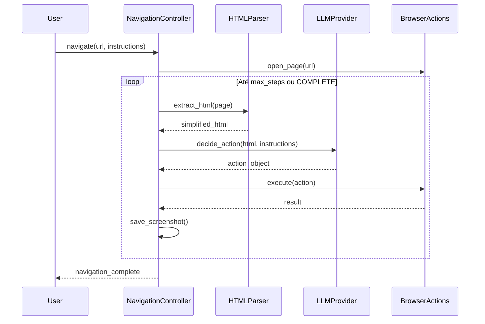
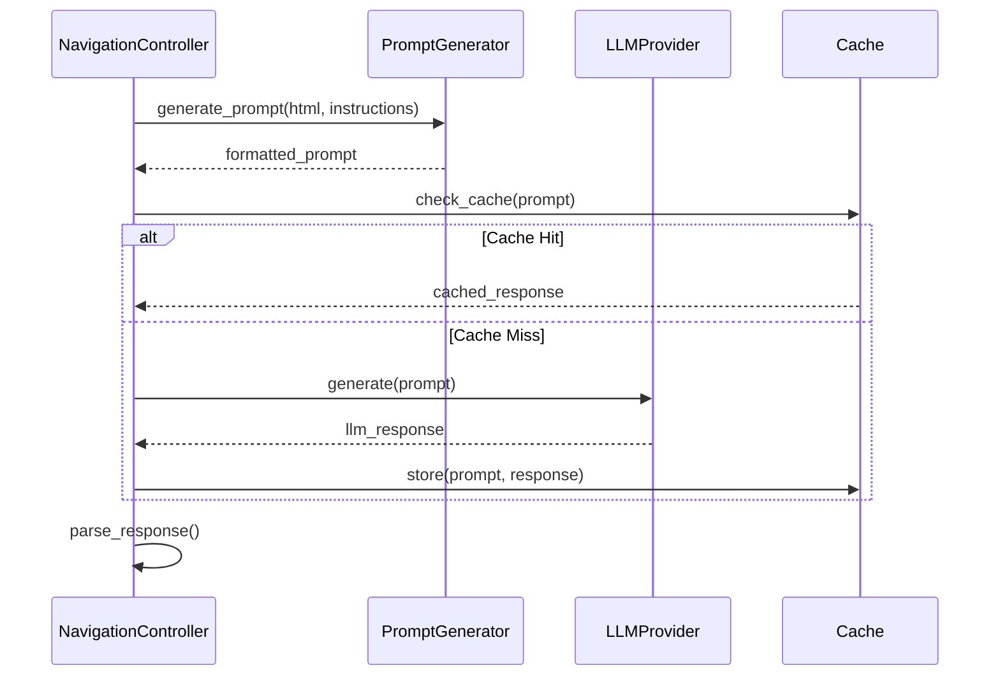

# Arquitetura do Sistema - Agente de QA Automatizado

## 📐 Visão Geral

Sistema modular de automação de testes web com arquitetura em camadas, utilizando LLMs para tomada de decisão inteligente.

## 🏛️ Arquitetura em Camadas

```
┌─────────────────────────────────────────────┐
│        Camada de Apresentação               │
│  ┌─────────┐  ┌──────────┐  ┌──────────┐  │
│  │   CLI   │  │ Tkinter  │  │   Web    │  │
│  │  main.py│  │ui_agente │  │  React   │  │
│  └─────────┘  └──────────┘  └──────────┘  │
└─────────────────────────────────────────────┘
                    ↓
┌─────────────────────────────────────────────┐
│         Camada de Aplicação                 │
│  ┌──────────────────────────────────────┐  │
│  │      Navigation Controller           │  │
│  │  (Orquestrador de Navegação)        │  │
│  └──────────────────────────────────────┘  │
└─────────────────────────────────────────────┘
                    ↓
┌─────────────────────────────────────────────┐
│         Camada de Domínio                   │
│  ┌─────────┐  ┌────────┐  ┌─────────────┐ │
│  │Browser  │  │  LLM   │  │Form Handler │ │
│  │Actions  │  │Provider│  │             │ │
│  └─────────┘  └────────┘  └─────────────┘ │
└─────────────────────────────────────────────┘
                    ↓
┌─────────────────────────────────────────────┐
│      Camada de Infraestrutura               │
│  ┌──────────┐  ┌────────┐  ┌──────────┐   │
│  │Playwright│  │  HTTP  │  │   I/O    │   │
│  │          │  │ Client │  │  Logging │   │
│  └──────────┘  └────────┘  └──────────┘   │
└─────────────────────────────────────────────┘
```

## 🧩 Componentes Principais

### 1. Navigation Controller (`navigation_controller.py`)

**Responsabilidade**: Orquestrar o fluxo de navegação

```python
class NavigationController:
    def __init__(self, page, llm_client, max_steps):
        self.page = page
        self.llm = llm_client
        self.max_steps = max_steps
    
    def navigate(self, instructions):
        for step in range(self.max_steps):
            html = extract_html(self.page)
            action = self.llm.decide_action(html, instructions)
            self.execute_action(action)
            if action.type == "COMPLETE":
                break
```

**Padrões Aplicados**:
- Strategy Pattern (diferentes estratégias de extração HTML)
- Template Method (fluxo de navegação)

### 2. LLM Provider (`llm_providers.py`)

**Responsabilidade**: Abstração de provedores de LLM

```python
class LLMProvider(ABC):
    @abstractmethod
    def generate(self, prompt: str) -> str:
        pass

class LMStudioProvider(LLMProvider):
    def generate(self, prompt: str) -> str:
        response = requests.post(f"{self.url}/v1/completions", ...)
        return response.json()['choices'][0]['text']
```

**Padrões Aplicados**:
- Abstract Factory
- Strategy Pattern
- Dependency Injection

### 3. Browser Actions (`browser_actions.py`)

**Responsabilidade**: Executar ações no navegador

```python
class BrowserAction:
    def execute(self, page, selector):
        pass

class ClickAction(BrowserAction):
    def execute(self, page, selector):
        page.click(selector)

class FillAction(BrowserAction):
    def execute(self, page, selector, value):
        page.fill(selector, value)
```

**Padrões Aplicados**:
- Command Pattern
- Composite Pattern (ações compostas)

### 4. Form Handler (`form_handler.py`)

**Responsabilidade**: Manipulação inteligente de formulários

```python
class FormHandler:
    def fill_form(self, form_data):
        for field in form_data:
            value = self.generate_value(field.type)
            field.fill(value)
    
    def generate_value(self, field_type):
        # Factory para gerar valores apropriados
        return ValueGeneratorFactory.create(field_type).generate()
```

**Padrões Aplicados**:
- Factory Pattern
- Strategy Pattern

### 5. HTML Parser (`html_parser.py`)

**Responsabilidade**: Extração e simplificação de HTML

```python
class HTMLParser:
    def extract_interactive_elements(self, html):
        soup = BeautifulSoup(html, 'html.parser')
        elements = []
        for tag in ['button', 'a', 'input', 'select']:
            elements.extend(soup.find_all(tag))
        return self.simplify(elements)
```

**Padrões Aplicados**:
- Builder Pattern (construção de estrutura simplificada)
- Chain of Responsibility (filtros de extração)

## 🔄 Fluxos de Dados

### Fluxo de Navegação



### Fluxo de LLM



## 🎨 Padrões de Design Aplicados

### 1. Dependency Injection

```python
# Injeção de dependências
class NavigationController:
    def __init__(self, 
                 page: Page,
                 llm_provider: LLMProvider,
                 html_parser: HTMLParser,
                 logger: Logger):
        self.page = page
        self.llm = llm_provider
        self.parser = html_parser
        self.logger = logger
```

**Benefícios**:
- Testabilidade
- Flexibilidade
- Baixo acoplamento

### 2. Strategy Pattern

```python
# Diferentes estratégias de extração
class ExtractionStrategy(ABC):
    @abstractmethod
    def extract(self, page): pass

class StandardExtraction(ExtractionStrategy):
    def extract(self, page):
        return page.content()

class OptimizedExtraction(ExtractionStrategy):
    def extract(self, page):
        return page.evaluate("/* custom JS */")
```

### 3. Factory Pattern

```python
class LLMProviderFactory:
    @staticmethod
    def create(provider_type: str, config: dict) -> LLMProvider:
        if provider_type == "lmstudio":
            return LMStudioProvider(config['url'])
        elif provider_type == "ollama":
            return OllamaProvider(config['url'])
        elif provider_type == "api_externa":
            return ExternalAPIProvider(config['url'], config['api_key'])
        raise ValueError(f"Unknown provider: {provider_type}")
```

### 4. Observer Pattern

```python
class NavigationObserver(ABC):
    @abstractmethod
    def on_action_executed(self, action): pass

class LoggingObserver(NavigationObserver):
    def on_action_executed(self, action):
        logger.info(f"Action executed: {action}")

class ScreenshotObserver(NavigationObserver):
    def on_action_executed(self, action):
        save_screenshot(action.step)
```

### 5. Template Method

```python
class BaseAgent(ABC):
    def execute(self):
        self.setup()
        self.navigate()
        self.teardown()
    
    @abstractmethod
    def navigate(self): pass
    
    def setup(self):
        # Implementação padrão
        pass
    
    def teardown(self):
        # Implementação padrão
        pass
```

## 🔌 Extensibilidade

### Adicionando Novo Provider LLM

1. **Implementar Interface**
```python
class CustomLLMProvider(LLMProvider):
    def generate(self, prompt: str) -> str:
        # Implementação específica
        pass
```

2. **Registrar Factory**
```python
LLMProviderFactory.register("custom", CustomLLMProvider)
```

3. **Configurar**
```python
config = {
    'provider': 'custom',
    'url': 'https://custom.api.com',
    'api_key': 'key'
}
```

### Adicionando Nova Ação

1. **Criar Classe de Ação**
```python
class HoverAction(BrowserAction):
    def execute(self, page, selector):
        page.hover(selector)
```

2. **Registrar Parser**
```python
ActionParser.register("HOVER", HoverAction)
```

## 📊 Decisões Arquiteturais

### ADR-001: Uso de Playwright ao invés de Selenium

**Contexto**: Necessidade de automação web moderna

**Decisão**: Usar Playwright

**Razões**:
- API mais moderna e async
- Melhor performance
- Suporte nativo a múltiplos browsers
- Screenshots automáticos
- Network interception

### ADR-002: Arquitetura em Camadas

**Contexto**: Manutenibilidade e escalabilidade

**Decisão**: Separar em camadas distintas

**Razões**:
- Separação de responsabilidades
- Facilita testes
- Permite substituir componentes
- Reduz acoplamento

### ADR-003: Abstração de LLM Providers

**Contexto**: Múltiplos provedores de LLM

**Decisão**: Interface comum para todos os providers

**Razões**:
- Flexibilidade para trocar providers
- Facilita testes (mocks)
- Permite fallback entre providers
- Suporta cache unificado

## 🔍 Qualidade de Código

### Métricas

- **Cobertura de Testes**: > 80%
- **Complexidade Ciclomática**: < 10
- **Duplicação de Código**: < 5%
- **Acoplamento**: Baixo (< 5 dependências por módulo)
- **Coesão**: Alta (funções com responsabilidade única)

### Ferramentas

```bash
# Análise de código
pylint agent/
flake8 agent/
mypy agent/

# Complexidade
radon cc agent/ -a

# Cobertura
pytest --cov=agent tests/
```

## 📚 Referências

- [Clean Architecture (Robert C. Martin)](https://blog.cleancoder.com/uncle-bob/2012/08/13/the-clean-architecture.html)
- [Design Patterns (Gang of Four)](https://refactoring.guru/design-patterns)
- [Domain-Driven Design](https://martinfowler.com/bliki/DomainDrivenDesign.html)
- [SOLID Principles](https://en.wikipedia.org/wiki/SOLID)

---

**Arquitetura em constante evolução - sempre buscando melhorias! 🏗️**
